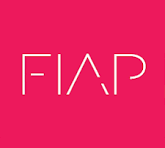

  
   
  
   
  <h1>🔒 Security Management, IAM & Vulnerability 1SM-2026</h1>

  
  
  

---

### 👤 Identificação do Aluno

<table>
  <tr>
    <td align="center"> <b>Paulo André Carminati</b></td>
    <td>
      <b>RM:</b> 570877  
      <b>Turma:</b> 1TDCPV  
      <b>GitHub:</b> <a href="https://github.com/carmipa">@carmipa</a>
    </td>
  </tr>
</table>

---

### 📂 Índice de CheckPoints (CPs)
Acompanhamento dos trabalhos entregues durante o semestre:

| CP | Descrição do Projeto | Pasta | Status |
| :-: | :--- | :-: | :-: |
| 1 | 🛡️ Elaboração de Política de Segurança da Informação (PSI) | [📁 CP1](./CP1) | ✅ Finalizado |

---

### 🛠️ Competências e Ferramentas
Desenvolvimento focado em Gestão de Segurança e Melhores Práticas:

-  IAM Security.
-  Risk Management.
-  Governance & Policies.
-  Documentation.

---

### 📖 Sobre a Unidade Curricular
Esta disciplina aborda os pilares da Segurança da Informação, com foco na criação de políticas robustas, gerenciamento de identidades, acessos e técnicas avançadas de detecção e mitigação de vulnerabilidades em ambientes corporativos.

---

  © 2026 Paulo André Carminati | FIAP - Tecnologia e Inovação

